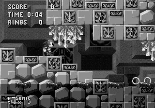
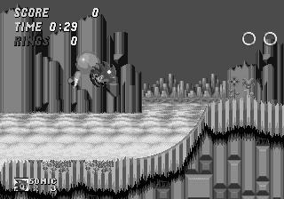
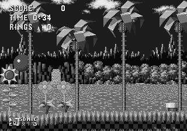
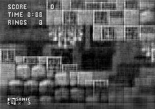
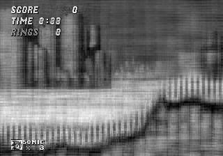
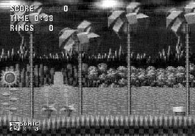

<figure>

</figure>

## Sonic Retro VAE (variational autoencoder)

### Introduction

Goal was to create my own neural network architecture to map the input feature space of 320x224 (grayscale) pixels down to a latent space of 16 floating point numbers and back to the original image.

If the image reproduced could be understandable by a human player then it would imply the input feature space could be compressed down to 16 floating point 32-bit numbers or less.

However this is not the case because the images show the most important part of the image (Sonic) is missing. Also the generated images tended to memorize levels to reproduce the images.

Despite these shortcomings it was a fun experiment to see how a naively designed CNN network could display some interesting, albeit not entirely useful results.

The network architecture was designed by yours truly using tensorflow.

### Images

    
 
    

        <h4>Original</h4>
        
        
        
    

    

        <h4>Reproduced</h4>
        
        
        
    

    

